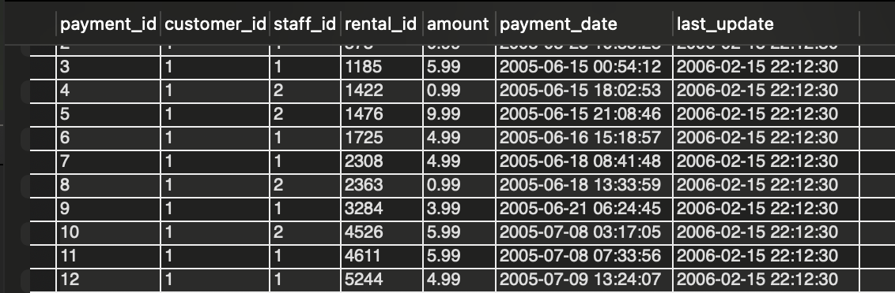

# Maven_Movies_Rental
Data analysis of movies CD/DVD rental (transactions) and inventory

# Maven Movies Data Analysis: Enhancing Insights for a Rental Business

## Project Overview:
This project analyzes a movie rental business's database to provide actionable insights for improving operations, marketing strategies, and inventory management. The dataset is hosted in the MAVENMOVIES database, and SQL was extensively used for exploratory data analysis (EDA), schema understanding, and answering business-critical ad-hoc queries.

## Project Objectives:

### Customer Insights:

Identify customer details (names, emails) for targeted marketing campaigns.
Analyze customer rental patterns to improve customer engagement.

### Movie Inventory Analysis:

Explore the rental inventory and classify movies based on rental rates and availability.
Provide recommendations for expanding the movie collection based on popularity and rental rates.
Revenue Optimization:

Analyze rental rates to identify trends and the profitability of various pricing categories.
Determine the most rented movie categories and ratings to maximize revenue.

### Operational Efficiency:

Help track and manage movie inventory effectively.
Highlight gaps in the inventory and optimize stock levels.

# Tools & Library Used
 &nbsp;

# Project Result

[Click here to get full code](https://github.com/Pranav-cloud-tab/Maven_Movies_Rental/blob/main/Movies_Rental_Business.sql)

# Query Task

1 You need to provide customer firstname, lastname and email id to the marketing team

[]&nbsp;

2 How many movies are with rental rate of $0.99? 

[]&nbsp;

3 We want to see rental rate and how many movies are in each rental category 

[]&nbsp;

4 Which rating has the most films? 

[]&nbsp;

5 Which rating is most prevalant in each store? 

[]&nbsp;

6 List of films by Film Name, Category, Language 

[]&nbsp;

7 How many times each movie has been rented out?

[]&nbsp;

8 REVENUE PER FILM (TOP 10 GROSSERS)

[]&nbsp;

9 Most Spending Customer so that we can send him/her rewards or debate points

[]&nbsp;

10 Which Store has historically brought the most revenue?

[]&nbsp;

11 How many rentals we have for each month

[]&nbsp;

12 Reward users who have rented at least 30 times (with details of customers)

[]&nbsp;

13 Could you pull all payments from our first 100 customers (based on customer ID)

[]&nbsp;

14 Now I’d love to see just payments over $5 for those same customers, since January 1, 2006

[]&nbsp;

15 Now, could you please write a query to pull all payments from those specific customers, along
   with payments over $5, from any customer?
   
[]&nbsp;   

16 We need to understand the special features in our films. Could you pull a list of films which
   include a Behind the Scenes special feature?

[]&nbsp;

17 unique movie ratings and number of movies G, PG, PG-13, R, NC-17

[]&nbsp;

18 Could you please pull a count of titles sliced by rental duration?

[]&nbsp;

19 RATING, COUNT_MOVIES,LENGTH OF MOVIES AND COMPARE WITH RENTAL DURATION

[]&nbsp;

20 I’m wondering if we charge more for a rental when the replacement cost is higher.
   Can you help me pull a count of films, along with the average, min, and max rental rate,
   grouped by replacement cost?

[]&nbsp;

21 “I’d like to talk to customers that have not rented much from us to understand if there is something
   we could be doing better. Could you pull a list of customer_ids with less than 15 rentals all-time?”

[]&nbsp;

22 “I’d like to see if our longest films also tend to be our most expensive rentals.
   Could you pull me a list of all film titles along with their lengths and rental rates, and sort them
   from longest to shortest?”   

[]&nbsp;

23 CATEGORIZE MOVIES AS PER LENGTH

[]&nbsp;

24 CATEGORIZING MOVIES TO RECOMMEND VARIOUS AGE GROUPS AND DEMOGRAPHIC

[]&nbsp;

25 “I’d like to know which store each customer goes to, and whether or
   not they are active. Could you pull a list of first and last names of all customers, and
   label them as either ‘store 1 active’, ‘store 1 inactive’, ‘store 2 active’, or ‘store 2 inactive’?”

[]&nbsp;

26 “Can you pull for me a list of each film we have in inventory?
   I would like to see the film’s title, description, and the store_id value
   associated with each item, and its inventory_id. Thanks!”   

[]&nbsp;

27 Actor first_name, last_name and number of movies

[]&nbsp;

28 “One of our investors is interested in the films we carry and how many actors are listed for each
   film title. Can you pull a list of all titles, and figure out how many actors are
   associated with each title?”

[]&nbsp;

29 “We will be hosting a meeting with all of our staff and advisors soon. Could you pull one list of all staff
   and advisor names, and include a column noting whether they are a staff member or advisor? Thanks!”   

[]&nbsp;

   
